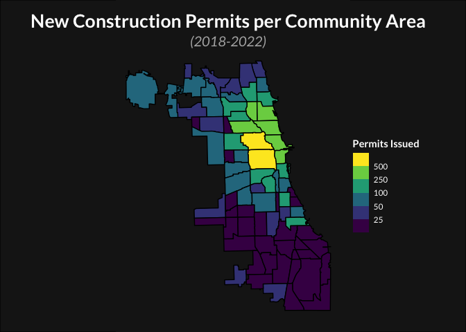

R Notebook
================

``` r
library(readr)
library(ggplot2)
library(broom)
library(geojsonio)
```

    ## Registered S3 method overwritten by 'geojsonsf':
    ##   method        from   
    ##   print.geojson geojson

    ## 
    ## Attaching package: 'geojsonio'

    ## The following object is masked from 'package:base':
    ## 
    ##     pretty

``` r
library(dplyr)
```

    ## 
    ## Attaching package: 'dplyr'

    ## The following objects are masked from 'package:stats':
    ## 
    ##     filter, lag

    ## The following objects are masked from 'package:base':
    ## 
    ##     intersect, setdiff, setequal, union

``` r
chicago_community_choropleth_data <- read_csv("new_construction_choropleth/choropleth.csv")
```

    ## Rows: 52602 Columns: 8

    ## ── Column specification ────────────────────────────────────────────────────────
    ## Delimiter: ","
    ## dbl (7): long, lat, order, piece, group, id, total
    ## lgl (1): hole
    ## 
    ## ℹ Use `spec()` to retrieve the full column specification for this data.
    ## ℹ Specify the column types or set `show_col_types = FALSE` to quiet this message.

``` r
plot <- ggplot() +  
        geom_polygon(
          data = chicago_community_choropleth_data,
          aes(fill = total, x = long, y = lat, group = group),
          color = "black"
        ) +
        theme_void() +
        coord_map() +  
        labs(    
          title = "New Construction Permits per Community Area",
          subtitle = "(2018-2022)"
        ) +
        scale_fill_viridis_b(
          trans = "log", 
          breaks = c(25, 50, 100, 250, 500), 
          name = "Permits Issued"
        ) +
        theme(
          plot.title = element_text(size = 25, 
                                    color = "white", 
                                    family = "Lato", 
                                    face = "bold", 
                                    hjust = 0.5),    
          plot.subtitle = element_text(size = 15, 
                                       color = "gray70", 
                                       family = "Lato", 
                                       face = "italic", 
                                       hjust = 0.5),    
          legend.title = element_text(color = "white", 
                                      family = "Lato", 
                                      face = "bold"),    
          legend.text = element_text(color = "white", 
                                     family = "Lato"),    
          plot.margin = margin(10, 10, 10, 0),
          legend.position = c(0.25, 0.5),
          plot.background = element_rect(fill = "gray10", color = NA)
        )
# Below sets the background to be completely gray; otherwise it isn't.
grid::grid.newpage()
grid::grid.draw(grid::rectGrob(gp = grid::gpar(fill = "gray10")))
print(plot, newpage = FALSE)
```

<!-- -->
